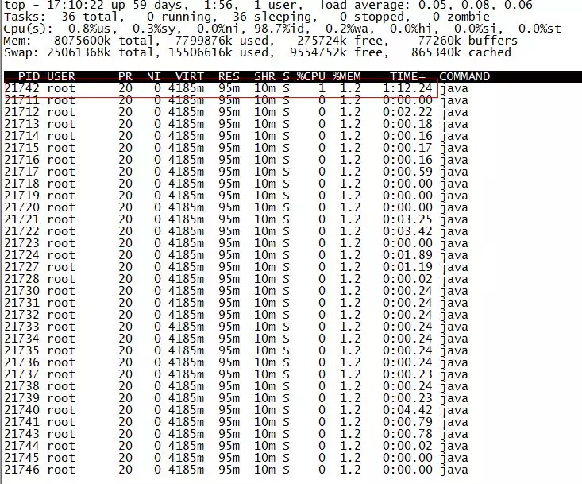

现实企业级Java应用开发、维护中，有时候我们会碰到下面这些问题：
- OutOfMemoryError，内存不足
- 内存泄露
- 线程死锁
- 锁争用（Lock Contention）
- Java进程消耗CPU过高
- ...
 
 这些问题在日常开发、维护中可能会被很多人忽视（比如有的人遇到上面的问题只是重启服务器或者调大内存，而不会深究问题的根源），但能够理解并解决这些问题是java程序员进阶的必备要求。本文将对一些常用的JVM性能调优监控工具进行介绍，希望能抛砖引玉之用。

### 而且这些监控、调优工具的使用，无论你是运维、开发、测试，都是必须掌握的
####  A、jps (Java Virtual Machine Process Status Tool)
> jsp主要用来输出JVM中运行的进程状态信息。语法格式如下：

    jsp [option] [hostid]

 如果不指定hostid就默认当前主机或者服务器。
 命令行参数选项说明如下：

     -q 不输出类名、jar名和传入Main方法的参数
     -m 输出传入Main方法的参数
     -l 输出Main类或Jar的全限名
     -v 输出传入JVM的参数

比如下面：
    
    root@ubuntu:/# jps -m -l
    2458 org.artifactory.standalone.main.Main /usr/local/artifactory-2.2.5/etc/jetty.xml
    29920 com.sun.tools.hat.Main -port 9998 /tmp/dump.dat
    3149 org.apache.catalina.startup.Bootstrap start
    30972 sun.tools.jps.Jps -m -l
    8247 org.apache.catalina.startup.Bootstrap start
    25687 com.sun.tools.hat.Main -port 9999 dump.dat
    21711 mrf-center.jar

#### B、jstack
 jstack主要用来查看某个Java进程内的线程堆栈信息。语法格式如下：

    jstack [option] pid
    jstack [option] executable core
    jstack [option] [server-id@] remote-hostname-or-ip

命令行参数选项说明如下：
                    
    -l long listings，会打印出额外的锁信息，在发生死锁时可以用jstack -l pid 来观察锁持有情况 -m mixed mode，不仅会输出Java堆栈信息，还会抛出C/C++堆栈信息（比如native方法）

jstack可以定位到线程堆栈，根据堆栈信息我们可以定位到具体代码，所以它在JVM性能调优中用的非常多。下面我们来一个实例找出某个java进程中最耗CPU的Java进程并定位堆栈信息，用到的命令有ps、top、printf、jstack、grep。

  第一步先找出Java进程的ID
    root@ubuntu:/# ps -ef | grep mrf-center | grep -v grep
    root     21711     1  1 14:47 pts/3    00:02:10 java -jar mrf-center.jar
  
  得到进程ID为21711，第二步找出该进程最消耗的CPU的线程，可以使用ps -Lfp pid或者 ps -mp pid -o THREAD,tid,time 或者top -Hp pid。我这里用第三个，输出如下：

  
  

  TIME列就是各个Java线程耗费CPU的时间，CPU时间最长的线程ID是21742的线程，用
        printf "%x\n" 21742

   得到的21742的十进制值为54ee，下面会用到。
   下一步轮到jstack上场了，它用来输出进程21711的堆栈信息，然后根据线程ID的十六进制值grep，如下：
    root@ubuntu:/# jstack 21711 | grep 54ee
    "PollIntervalRetrySchedulerThread" prio=10 tid=0x00007f950043e000 nid=0x54ee in Object.wait() [0x00007f94c6eda000]

可以看到CPU消耗在PollIntervalRetrySchedulerThread这个类的Object.wait(),找了一下代码定位：
        
    // Idle wait
    getLog().info("Thread [" + getName() + "] is idle waiting...");
    schedulerThreadState = PollTaskSchedulerThreadState.IdleWaiting;
    long now = System.currentTimeMillis();
    long waitTime = now + getIdleWaitTime();
    long timeUntilContinue = waitTime - now;
    synchronized(sigLock) { try {
            if(!halted.get()) {
                sigLock.wait(timeUntilContinue);
            }
        }   catch (InterruptedException ignore) {
        }
    }

 它是轮询任务的空闲等待代码，上面的sigLock.wait(timeUntilContinue)就对应了前面的Object.wait()。

 ### C、jmap（Memory Map）和 jhat（Java Heap Analysis Tool）
  jmap用来查看堆内存使用情况，一般结合jhat使用。
  jmap语法格式如下：

     jmap [option] pid
     jmap [option] executable core
     jmap [option] [server-id@]remote-hostname-or-ip
   如果运行在64位jvm上，可能需要制定J-d64命令选项参数。
     jmap -permstat pid

